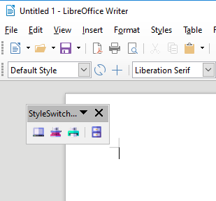
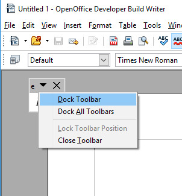
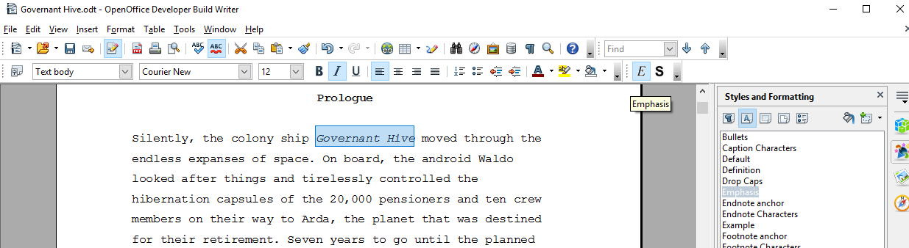
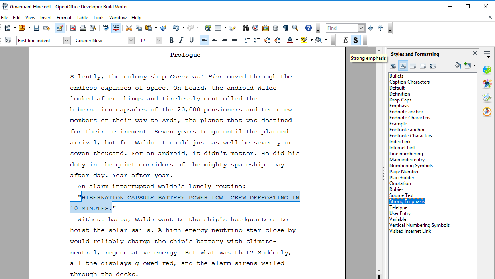

[Project homepage](https://peter88213.github.io/emph/)

## Instructions for use

## Place the toolbar

After installing the extension and restarting the office application, you will see a small toolbar. 

You can dock it to a suitable place on the user interface.

## Use the toolbar

There are two buttons:  _E_  for emphasize and  __S__  for strong emphasize.

### Assign "Emphasis" character style

1. Mark the text passage you want to emphasize.
2. Click the  _E_  button. 

### Assign "Strong Emphasis" character style

1. Mark the text passage you want to emphasize.
2. Click the  __S__  button. 

## Get help

In the  __Help__  section of the main menu, there is a  __emph help__  submenu. 

